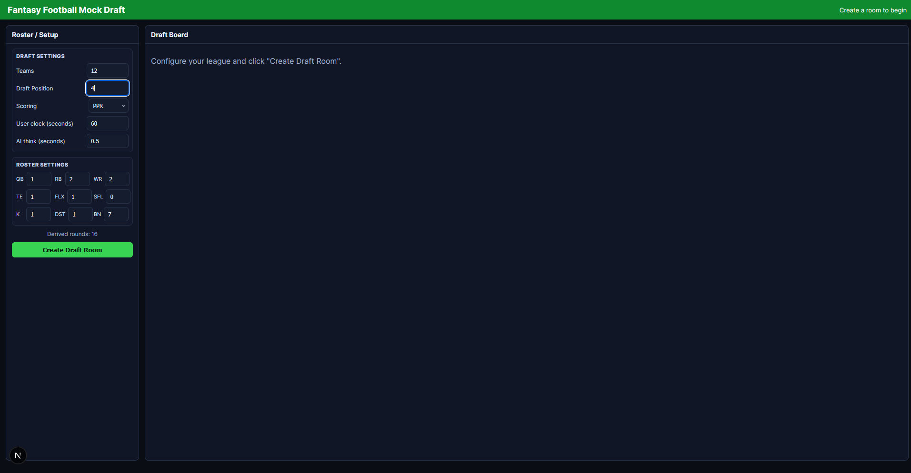
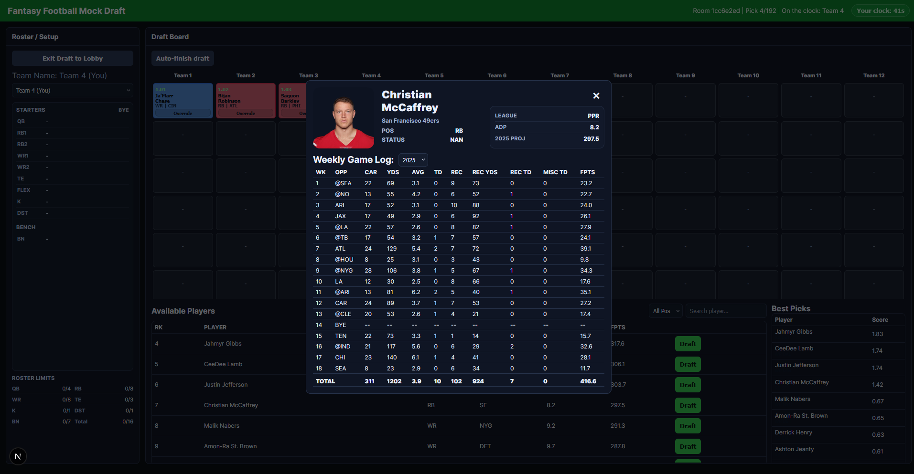
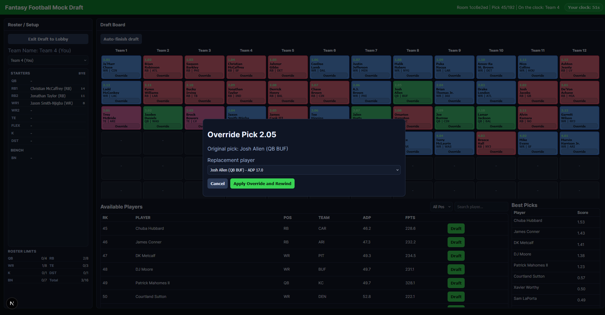
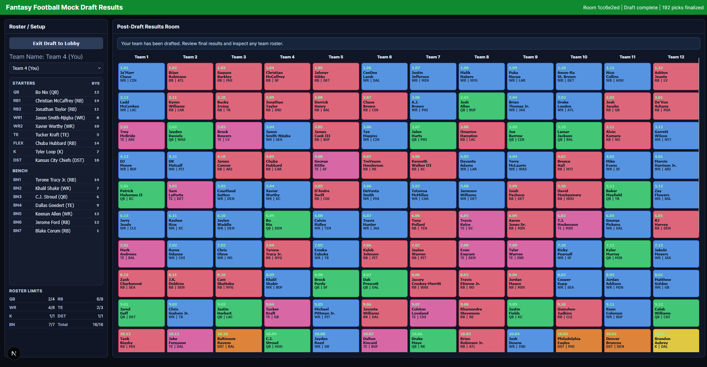

# NFL Fantasy Mock Draft Room

This repo is a small **full-stack mock draft** app:

- **Backend**: FastAPI (`backend/app`) loads a FantasyPros “master projections + ADP” CSV and simulates a snake draft.
- **Frontend**: Next.js (`frontend/`) provides the draft board UI.
- **Player cards**: weekly logs are pulled from **`nflreadpy`** on demand.

Earlier iterations included a separate Streamlit app plus a larger `src/fantasy_v2/` modeling package (custom projections, offseason weighting, etc.). That code path was removed to keep this repo focused on the mock draft MVP.

## Acknowledgments

Much of this codebase was written with assistance from **[Cursor](https://cursor.com)** (AI pair programming in the editor). Product direction, fantasy logic, and what shipped are still mine; Cursor accelerated implementation and refactors the same way other tooling would.

## Screenshots

### Draft lobby



### Player card (click a player on the board)



### Override a CPU pick



### Completed mock draft



## Prerequisites

- **Python 3.11+** (conda recommended on Windows)
- **Node.js 18+** (for the frontend)

## Quickstart (local dev)

### 1) Backend (FastAPI)

Create the conda env:

```bash
conda env create -f environment.yml
conda activate nfl-fantasy-v2
```

Run the API:

```bash
uvicorn backend.app.main:app --reload --port 8000
```

### 2) Frontend (Next.js)

```bash
cd frontend
npm install
npm run dev
```

If your API is not on `http://localhost:8000`, set:

```bash
set NEXT_PUBLIC_API_BASE=http://localhost:8000
```

### 3) Rankings file (FantasyPros master CSV)

The API defaults to:

`reference/FantasyPros_2025_Master_Projections_With_ADP.csv`

Replace that file when FantasyPros releases the next season’s exports.

## Optional: regenerate the master CSV

FantasyPros **raw** export CSVs live in:

`data/inputs/`

Regenerate the master file (writes to `reference/...` by default):

```bash
python scripts/build_fantasypros_master.py
```

Refresh `nfl_player_ids.csv` (writes to `data/inputs/nfl_player_ids.csv` by default):

```bash
python scripts/pull_recent_nflreadpy.py
```

## Production-ish run (no hot reload)

Backend:

```bash
uvicorn backend.app.main:app --host 0.0.0.0 --port 8000
```

Frontend (point it at your API):

```bash
cd frontend
npm install
npm run build
set NEXT_PUBLIC_API_BASE=http://localhost:8000
npm run start
```

## Tests

```bash
pytest -q
```

## Project layout

- `backend/app/`: FastAPI app (routes, draft engine, rankings load, nflreadpy enrichment)
- `backend/tests/`: API tests
- `frontend/`: Next.js UI
- `reference/`: **runtime** master FantasyPros CSV the API loads by default
- `data/inputs/`: raw FantasyPros export CSVs + `nfl_player_ids.csv` (source for rebuilding `reference/`)
- `data/generated/`: optional local outputs (e.g. comparison CSVs); not required to run the app
- `scripts/`: CLI helpers (refresh IDs, build master, compare masters) — not imported by the API at runtime

**Why it looks this way:** the web app is only `backend/` + `frontend/`. `reference/` and `data/` are **data assets** (versioned CSVs you may replace each season), kept out of `backend/` so the API package stays code-only. `scripts/` holds one-off CLIs you run locally; they are not part of the deployed service.

## FastAPI endpoints (MVP)

- `POST /api/v1/rooms`: create draft room
- `GET /api/v1/rooms/{room_id}`: room state
- `POST /api/v1/rooms/{room_id}/simulate-until-user`: let CPU draft until user turn
- `POST /api/v1/rooms/{room_id}/pick`: user submits pick
- `POST /api/v1/rooms/{room_id}/simulate-to-end`: auto-finish draft
- `GET /api/v1/rooms/{room_id}/players`: available players list/search/filter
- `GET /api/v1/rooms/{room_id}/recommendations`: top-N suggestion list
- `GET /api/v1/rooms/{room_id}/players/{player_key}/card`: player detail + game log

